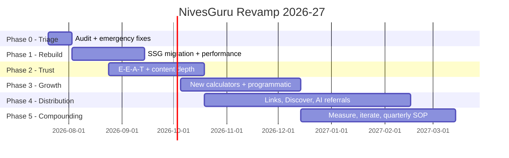

# NivesGuru Roadmap — July 2026 → March 2027

> Goal: **8,500+ organic visitors/day** (all-time record) reclaimed by end of Q1 2027.
> Strategy detail: [REVAMP-PLAN-2026.md](./REVAMP-PLAN-2026.md) · Task-level tracking: [CHECKLIST.md](./CHECKLIST.md)

---

## Phase 0 — Triage & Emergency Fixes 🚑
**20 Jul – 2 Aug 2026 (2 weeks) · Theme: stop the bleeding, establish truth**

The cheap, high-leverage fixes that don't need the rebuild — shipped on the *current* static site.

| # | Deliverable | Why now |
|---|---|---|
| 0.1 | **GSC forensic audit**: manual actions check, 24-month click/impression trend, which pages/queries lost traffic and when | Diagnosis before treatment; sets the real baseline for all KPIs |
| 0.2 | **Remove spam-risk schema** (LocalBusiness self-rating + fake-looking review, duplicate WebSite block) from all pages | Single biggest policy risk on a YMYL site |
| 0.3 | **Rate refresh sweep**: verify every rate against official sources (Q2 FY27 small-savings rates, current bank FD/RD slabs), fix all | Stale rates = trust + ranking poison |
| 0.4 | **Income-tax calculator updated to FY 2026-27** slabs (post-Budget 2026, Income-tax Act 2025 terms) | Highest-intent page with a hard correctness deadline |
| 0.5 | **Sitemap regenerated** with honest lastmods; robots.txt fixed; dead files (`ror.xml`, `urllist.txt`, `sitemaps*.zip`) removed | Crawl hygiene |
| 0.6 | **Service workers consolidated to one** (versioned cache, network-first for HTML) | Stale-cache pages are invisible sabotage |

**Exit criteria:** no manual actions (or reconsideration filed); Rich Results Test clean on 5 sample pages; every published rate verified ≤ 14 days old; baseline KPI dashboard live.

---

## Phase 1 — Technical Rebuild 🏗️
**3 Aug – 13 Sep 2026 (6 weeks) · Theme: one template, one data file, same URLs**

| # | Deliverable |
|---|---|
| 1.1 | SSG chosen (Eleventy vs Astro vs salvage `nextjs-fincal` branch — decision doc) with **pure static output** |
| 1.2 | Layout system: one base template (head/nav/footer/schema/hreflang) replacing 148 copies |
| 1.3 | `data/rates.json` + per-calculator data files driving pages, rate tables, "updated on" badges |
| 1.4 | **URL freeze verified**: build-time check that all 148 existing URLs resolve identically |
| 1.5 | Performance budget met: purged CSS, critical CSS inline, lazy ads, responsive webp/avif — **LCP < 2.0s / INP < 200ms / CLS < 0.1** on Moto-G-class Android |
| 1.6 | Build-time sitemap + hreflang + `llms.txt`; CI deploy (GitHub Actions → Pages) |

**Exit criteria:** full site rebuilt from templates with byte-equivalent URLs; CWV lab targets met on 10 heaviest pages; a rate change in `rates.json` propagates site-wide in one commit.

---

## Phase 2 — Trust & Content Depth 🎓
**24 Aug – 18 Oct 2026 (8 weeks, overlaps P1) · Theme: E-E-A-T for YMYL**

| # | Deliverable |
|---|---|
| 2.1 | Author & reviewer bios (real credentials) + `Person` schema; byline + "Last reviewed" on every calculator |
| 2.2 | Editorial & Data Policy page; upgraded About page |
| 2.3 | Every EN calculator page deepened: formula + worked example, sourced rate table, 5–8 FAQs with `FAQPage` schema, comparison cross-links |
| 2.4 | Primary-source citations (RBI/India Post/NSI/incometax.gov.in) on 100% of pages |
| 2.5 | HI/BN parity pass for the top-20-traffic calculators |
| 2.6 | Internal-link architecture: category hubs (Post Office / Banks / Tax / Mutual Fund / Pension) with breadcrumb schema |

**Exit criteria:** 100% EN pages have byline + review date + citations; FAQ rich results appearing in GSC; hub pages indexed.

---

## Phase 3 — Growth Engine 📈
**5 Oct – 13 Dec 2026 (10 weeks) · Theme: more pages that deserve to rank**

| # | Deliverable |
|---|---|
| 3.1 | **Bank expansion:** HDFC, ICICI, Axis, Kotak, Canara, IDBI, IPPB × FD/RD/SB (EN+HI+BN) — ~60 new pages from the template |
| 3.2 | **New calculators:** Home-loan EMI, Car-loan EMI, Personal-loan EMI, Gratuity, HRA, Salary in-hand, EPF, XIRR, Retirement/FIRE corpus |
| 3.3 | **Rate hubs:** "Post Office rates {quarter}", "Bank FD rates compared" — quarterly-refreshed |
| 3.4 | Scenario pages *only* where keyword data justifies (unique computed tables; noindex anything thin) |
| 3.5 | Keyword-gap research doc (GSC + Keyword Planner, IN + HI/BN queries) driving 3.1–3.4 priority order |

**Exit criteria:** 220+ quality pages indexed; new-page cohort earning impressions within 14 days of publish; zero thin-content warnings.

---

## Phase 4 — Distribution & Authority 📣
**19 Oct 2026 – Feb 2027 (ongoing) · Theme: earn demand, don't just wait for it**

| # | Deliverable |
|---|---|
| 4.1 | Embeddable calculator widget with attribution backlink; outreach to 30 IN personal-finance blogs (EN/HI/BN) |
| 4.2 | Quarterly rate-change + Budget-2027-day update posts engineered for Google Discover |
| 4.3 | YouTube Shorts pipeline (2/week) from existing @nivesguru-india channel → tool links |
| 4.4 | AI-referral tracking (ChatGPT/Gemini/Perplexity sources in GA4) + `llms.txt` iteration |
| 4.5 | Digital-PR data drops ("₹10K SIP since 2016 → today", "PPF vs inflation, 15-yr view") |

**Exit criteria:** 25+ quality referring domains gained; Discover impressions non-zero and trending; measurable AI-assistant referral traffic.

---

## Phase 5 — Compounding & Operations 🔁
**Dec 2026 onward (permanent) · Theme: never go stale again**

| # | Deliverable |
|---|---|
| 5.1 | **Quarterly rate SOP** calendar-locked (1 Jan / 1 Apr / 1 Jul / 1 Oct + RBI MPC dates + Budget day) — rates live < 24h |
| 5.2 | Weekly KPI review ritual (GSC clicks/day, CWV, indexation, RPM) |
| 5.3 | Budget 2027 day-one tax-calculator update (1 Feb 2027) — the single biggest annual traffic event |
| 5.4 | Quarterly content-decay review: refresh or prune the bottom 10% |
| 5.5 | Post-mortem at 8.5K/day: what worked, doubling-down plan |

**Exit criteria (project success):** ≥ 8,500 organic visitors/day sustained over a 30-day average by 31 Mar 2027.

---

## Dependency Notes

- **Phase 0 → 1 is strictly sequential** (audit findings may re-order everything).
- Phase 2 overlaps Phase 1: content can be drafted while the build system is assembled, then poured into templates.
- Phase 3 hard-depends on Phase 1 (never hand-author 60 new pages) and on 2.1–2.2 (never launch YMYL pages without E-E-A-T surface).
- Phase 4 starts once Phase 2's trust surface exists — outreach with fake-review schema still live would be wasted.
